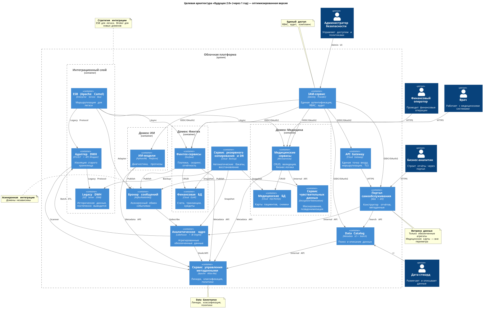
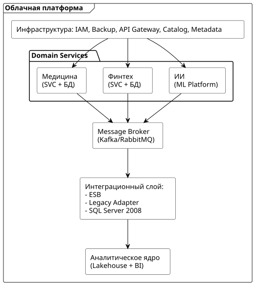

# Задание 1. Проектирование целевой архитектуры и приоритизация проблем для поддержки ключевых бизнес-сценариев компании

> 1. Спроектируйте архитектуру системы для «Будущего 2.0» через год. Составьте диаграмму контейнеров в модели C4. На диаграмме отметьте, как целевая архитектура будет поддерживать ключевые бизнес-сценарии компании. Например, быстрая подготовка отчётности, независимое развитие финтех- и ИИ-направлений, масштабирование для новых бизнесов.
> 2. Опишите проблемные места. Сделайте это в удобной для вас форме (список или таблица). Обязательно укажите, какие бизнес-сценарии страдают от этих проблем. Скажем, из-за того, что отчёт строится часами, появляются задержки в принятии управленческих решений).
> 3. Приоритизируйте выявленные проблемы. Для этого используйте методы, которые вы уже изучили на курсе (MoSCoW, матрица Эйзенхауэра). Приоритизацию свяжите с целями бизнеса (что критично для выручки, скорости выхода на рынок, качества медицинских или финансовых сервисов).

---

## 1. Целевая архитектура системы (через 1 год)

### 1.1. Описание архитектуры

Архитектура построена по **доменному принципу** с чётким разделением на три бизнес-домена (Медицина, Финтех, ИИ) и общие инфраструктурные сервисы.
Ключевое решение - изоляция чувствительных медицинских данных от витрины аналитики.

### 1.2. Основные компоненты

| **Компонент**                    | **Назначение**                                                       | **Уникальность для кейса**                                                                     |
| ----------------------------------------------- | ------------------------------------------------------------------------------------ | ------------------------------------------------------------------------------------------------------------------------ |
| Портал самообслуживания   | Конструктор отчётов для бизнес-пользователей | Аналитики строят отчёты без участия IT-команды                                     |
| Data Catalog                                    | Единый поиск и описание данных                             | Поиск данных across all доменов через один интерфейс                                 |
| Metadata Service (Apache Atlas-like)            | Управление data linage, классификация, политики       | Автоматическое отслеживание происхождения данных                            |
| IAM-сервис                                | Единая аутентификация и RBAC                                    | Одна политика доступа для медицины и финтеха                                       |
| Sensitive Data Service                          | Маскирование и токенизация ПДн                            | Автоматическая защита перед попаданием в аналитику                          |
| Message Broker (Kafka/RabbitMQ)                 | Асинхронный обмен событиями между доменами     | Домены независимы, сбой в одном не блокирует остальные                     |
| ESB (Apache Camel)                              | Интеграция с легаси-системами                              | Сохранён для обратной совместимости, постепенная миграция на Broker |
| Legacy Adapter                                  | Изоляция SQL Server 2008                                                     | Работа со старым DWH без остановки бизнеса                                              |
| Аналитическое ядро (Lakehouse) | Агрегированные обезличенные данные                   | Быстрые отчёты (секунды вместо часов)                                                     |
| Backup & DR                                     | Централизованное резервирование                        | RPO < 15 мин, RTO < 1 час для критичных систем                                                   |
| API Gateway                                     | Единая точка входа                                                   | Маршрутизация, rate limiting, TLS                                                                           |

### 1.3. Доменная структура в облачной платформе

### 1.4. Как архитектура поддерживает бизнес-сценарии

| **Бизнес-сценарий**                         | **Архитектурное решение**                  | **Ожидаемый результат**                                |
| --------------------------------------------------------------- | -------------------------------------------------------------------- | ------------------------------------------------------------------------------ |
| Быстрая подготовка отчётности        | Analytics Core + предзагруженные агрегаты     | Секунды/минуты вместо часов                            |
| Независимое развитие финтеха и ИИ  | Границы доменов + собственные БД          | Параллельная работа команд без блокировок |
| Масштабирование под новые бизнесы | API Gateway + стандартные контракты данных | Новый домен подключается за недели               |
| Безопасность и комплаенс                  | IAM + Sensitive Data Service + Metadata                              | Соответствие 152-ФЗ, HIPAA, аудит доступа            |
| Надёжность и восстановление            | Backup & DR + геораспределение                       | RPO < 15 мин, RTO < 1 час                                                |
| Самообслуживание аналитиков           | Data Portal + Data Catalog                                           | Бизнес строит отчёты без участия IT                |

---

## 2. Проблемные места и их влияние на бизнес

| **Проблема**                                                             | **Затронутые бизнес-сценарии**                                                 | **Бизнес-последствия**                                                                                                                     |
| -------------------------------------------------------------------------------------- | ------------------------------------------------------------------------------------------------------------ | ----------------------------------------------------------------------------------------------------------------------------------------------------------------- |
| Отчёты формируются часами                                       | Принятие управленческих решений, оперативная аналитика | Задержки в реакциях на рыночные изменения, упущенные возможности                                     |
| Бизнес-логика в DWH                                                       | Развитие финтеха и ИИ-направлений                                               | Любое изменение требует правки центрального хранилища => долгие релизы                          |
| Смешанные медицинские и финансовые данные         | Комплаенс, аналитика, интеграция партнёров                         | Сложность аудита, риски утечек, барьеры для подключения внешних сервисов                       |
| ESB как единая точка отказа                                        | Все интеграционные сценарии                                                         | Сбой в ESB парализует обмен данными между всеми системами                                                      |
| Устаревший стек (SQL Server 2008, PowerBuilder)  + Vendor Lock | Поддержка и развитие любых систем                                          | Рост затрат, дефицит специалистов, риски безопасности                                                          |
| Отсутствие самообслуживания для аналитиков | Построение отчётности                                                                    | Зависимость от IT-команды, низкая скорость получения инсайтов                                             |
| Разрозненные учётные записи                                   | Доступ к системам, аудит                                                                 | Риски несанкционированного доступа, сложность отзыва прав                                                 |
| Нет централизованного бэкапа                                 | Восстановление после сбоев                                                           | Длительные простои, риски потери данных, штрафы регуляторов                                               |
| Отсутствие каталога данных                                     | Поиск и понимание данных                                                                | Аналитики тратят время на поиск источников, риски использования некорректных данных |
| Нет отслеживания lineage                                                | Аудит, комплаенс, отладка отчётов                                                | Невозможно определить источник ошибки, сложности с проверками                                          |

---

## 3. Приоритизация проблем (MoSCoW)

### 🔴 Must have (критично для запуска через 1 год)

| **Проблема**                                               | **Компонент решения**                | **Связь с целями бизнеса**                                                                                                                                                                                                                                                                                                                                                                     |
| ------------------------------------------------------------------------ | ---------------------------------------------------------- | ----------------------------------------------------------------------------------------------------------------------------------------------------------------------------------------------------------------------------------------------------------------------------------------------------------------------------------------------------------------------------------------------------------------------- |
| Изоляция медицинских данных от витрины | Sensitive Data Service + границы доменов     | Требование регуляторов + условие задачи                                                                                                                                                                                                                                                                                                                                               |
| IAM-сервис                                                         | Единая аутентификация и RBAC          | Безопасность и аудит для финтеха и медицины                                                                                                                                                                                                                                                                                                                                        |
| Data Catalog + Metadata Service                                          | Поиск, lineage, классификация            | Без доверия к данным бизнес не использует витрину                                                                                                                                                                                                                                                                                                                             |
| Legacy Adapter                                                           | Изоляция SQL Server 2008                           | Миграция без остановки текущих операций                                                                                                                                                                                                                                                                                                                                              |
| Message Broker                                                           | Асинхронная интеграция доменов | Независимость доменов, снижение связности                                                                                                                                                                                                                                                                                                                                          |
| Separate Domain                                                          | Отдельные домены для продуктов  | Разделение доменов позволит быстрее реагировать на регуляторные требования - финансы - медицина Сильно зарегламентированы. Для ИИ всё очень быстро меняется, нужно  иметь возможность безопасно обновляться |

### 🟡 Should have (важно для стабильности)

| **Проблема**                                            | **Компонент решения**                                | **Обоснование**                                                                                                                                                                                          |
| --------------------------------------------------------------------- | -------------------------------------------------------------------------- | ------------------------------------------------------------------------------------------------------------------------------------------------------------------------------------------------------------------------- |
| Backup & DR для критичных доменов                  | Централизованный сервис резервирования | Требуется для промышленной эксплуатации                                                                                                                                               |
| Выгрузка агрегатов из Legacy DWH в Analytics Core | Batch ETL через Legacy Adapter                                        | Ускоряет отчётность на первом этапе, позволяет сразу не отказываться от хранилища и поддерживать текущий бизнес |

### 🟢 Could have (желательно, если останется ресурс)

| **Проблема**                | **Компонент решения**        | **Обоснование**                                                                                                      |
| ----------------------------------------- | -------------------------------------------------- | ------------------------------------------------------------------------------------------------------------------------------------- |
| Полный отказ от PowerBuilder | Новый клиентский интерфейс | Улучшает UX, но можно оставить как legacy, отказ может помочь снять vendor lock  |
| CDC для легаси                   | Real-time выгрузка вместо batch      | Уменьшает задержки в аналитике                                                                             |

### ⚪ Won't have (за рамками 1 года)

| **Проблема**                                        | **Обоснование**                                                                                       |
| ----------------------------------------------------------------- | ---------------------------------------------------------------------------------------------------------------------- |
| Полная замена всех легаси-систем      | Слишком рискованно; стратегия — постепенная миграция по доменам |
| Единая ML-платформа для всех доменов | ИИ развивается автономно, интеграция через события достаточна    |

---

## 4. Принципы архитектуры 

| **Принцип**        | **Описание**                                                                                                             |
| ------------------------------- | -------------------------------------------------------------------------------------------------------------------------------------- |
| Domain-First                    | Границы определяются бизнес-возможностями, а не техническими удобствами |
| Data as a Product               | Каждый домен предоставляет данные с описанием, контрактом и линиджем        |
| Security by Design              | IAM, маскирование и аудит встроены в ядро архитектуры                                        |
| Async by Default                | Домены общаются через события, а не синхронные вызовы                                     |
| Legacy First, но не Forever | Старое хранилище изолировано, но не блокирует развитие                                  |
| Resilience as a Feature         | Бэкап и восстановление заложены в архитектуру                                                  |
| Evolutionary Migration          | Постепенный переход с легаси, параллельная работа систем                              |

---

## 5. Ключевые потоки данных

| **№** | **Поток**                                 | **Описание**                                                                                     |
| ------------ | ---------------------------------------------------- | -------------------------------------------------------------------------------------------------------------- |
| 1            | Analyst → Data Portal → Analytics Core             | Бизнес-пользователь строит отчёты через витрину                      |
| 2            | Doctor → Med Service → Sensitive Service → Broker | Медицинские данные маскируются перед передачей в аналитику |
| 3            | Fintech Service → Broker → Analytics Core          | Финансовые события асинхронно попадают в аналитику                |
| 4            | AI Service → Broker → Analytics Core               | Результаты ИИ-моделей агрегируются для отчётов                        |
| 5            | Legacy Adapter → Legacy DWH                         | Изолированный доступ к старому хранилищу                                   |
| 6            | All Domains → Metadata Service                      | Регистрация схем и lineage для всех данных                                       |
| 7            | IAM → All Services                                  | Единая проверка прав доступа                                                          |
| 8            | Backup DR → All DBs                                 | Централизованное резервное копирование                                     |
| 9            | ESB → Message Broker                                | Постепенная миграция интеграции со старой шины на брокер      |

---

## 6. Ограничения и допущения

| **Ограничение**                                                                                              | **Обоснование**                                                                                      |
| ----------------------------------------------------------------------------------------------------------------------------- | --------------------------------------------------------------------------------------------------------------------- |
| Медицинские карты и истории болезней НЕ попадают в витрину                  | Прямое требование задачи + комплаенс                                                   |
| Legacy DWH сохраняется на первый год                                                                    | Слишком рискованно останавливать бизнес для полной миграции      |
| ESB сохраняется для обратной совместимости                                                 | Позволяет мигрировать потоки постепенно, без «большого взрыва» |
| Временное сохранение легаси-систем в отдельных доменах допускается | Разрешено бизнесом в целях снижения рисков                                       |
