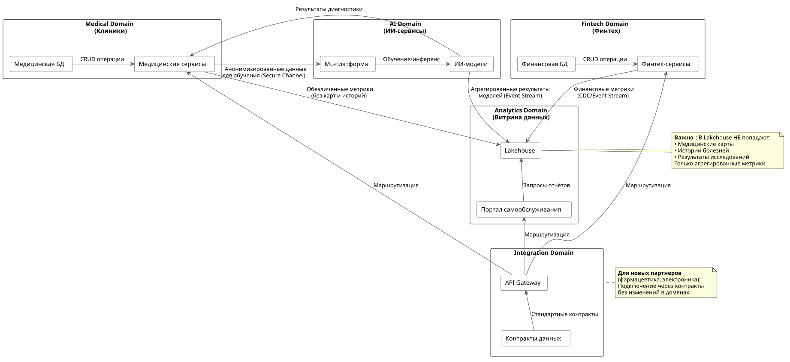

# Задание 2. Разделение системы на домены и моделирование потоков данных для поддержки ключевых бизнес-сценариев

> 1. Разделите систему на домены, чтобы их можно было развивать независимо без необходимости внедрять новую логику в DWH. Обоснуйте это разделение, опираясь на бизнес-сценарии: определите, какие домены нужны для поддержки клиники, финтех- и ИИ-сервисов и будущих партнёров (фармацевтика, электроника).
> 2. Отразите потоки данных между доменами. Для этого отрисуйте Data Flow Diagram и отразите на ней, как бизнес-сценарии (например, интеграция нового финтех-сервиса или использование ИИ для анализа медицинских данных) будут обеспечены потоками данных.
> 3. Аргументируйте логику разделения на домены. Опишите преимущества для бизнеса: ускорение вывода продуктов, снижение зависимости от DWH, возможность отдельного развития направлений.

## 1. Разделение на домены

| **Домен** | **Бизнес-зона ответственности**                                                              | **Почему выделен отдельно**                                                                                                |
| -------------------- | --------------------------------------------------------------------------------------------------------------------------- | ----------------------------------------------------------------------------------------------------------------------------------------------------- |
| Medical Domain       | Клиники, пациенты, медицинские карты, снимки, назначения                     | Регуляторные требования, чувствительные данные,  специфичные процессы          |
| Fintech Domain       | Счета, транзакции, кредиты, платежи, финансовая отчётность                 | Банковская лицензия, отдельные регуляторы,  независимое развитие продуктов |
| AI Domain            | ИИ-модели для диагностики, прогнозы, аналитика результатов лечения | Экспертиза ML-команды, отдельные циклы разработки и обучения моделей                    |
| Analytics Domain     | Витрина данных, отчётность, портал самообслуживания                            | Единая точка аналитики для всех бизнес-направлений, без чувствительных данных |
| Integration Domain   | API Gateway, маршрутизация, безопасность, контракты данных                          | Стандартизация взаимодействия, подключение новых партнёров                                  |

### Обоснование разделения по бизнес-сценариям:

| **Бизнес-сценарий**                                    | **Задействованные домены** | **Почему такое разделение работает**                                                                                   |
| -------------------------------------------------------------------------- | ----------------------------------------------------- | --------------------------------------------------------------------------------------------------------------------------------------------------------- |
| Запуск нового финтех-продукта                    | Fintech + Integration                                 | Не требует изменений в Medical и AI доменах                                                                                    |
| Подключение фармацевтического партнёра | Integration + Analytics                               | Партнёр получает данные через стандартные контракты, без доступа к ядру                 |
| Обновление ИИ-моделей диагностики            | AI + Medical                                          | Медицинские данные остаются в своём домене, ИИ получает их по защищённому каналу |
| Формирование кросс-доменной отчётности  | Analytics (агрегирует все домены)  | Витрина забирает только обезличенные агрегаты, не нарушая границ                             |

## 2. Data Flow Diagram (DFD) — целевое состояние

### Ключевые потоки данных для бизнес-сценариев:

| **Сценарий**                                    | **Поток данных**          | **Технология передачи**  |
| ------------------------------------------------------------- | ------------------------------------------ | ------------------------------------------------ |
| Интеграция нового финтех-сервиса | Fintech → Analytics                       | Event Stream (CDC)                               |
| ИИ-анализ медицинских данных         | Medical → AI → Medical                   | Secure Channel (внутри периметра) |
| Отчётность для руководства            | Все домены → Analytics → Portal | Batch + Real-time агрегаты               |
| Подключение внешнего партнёра      | Analytics → Partner                       | API через Integration Domain                |

## 3. Аргументация разделения на домены

### Преимущества для бизнеса:

| **Преимущество**                             | **Как достигается**                                                                                                        | **Бизнес-ценность**                                                                              |
| -------------------------------------------------------------- | ---------------------------------------------------------------------------------------------------------------------------------------------- | -------------------------------------------------------------------------------------------------------------------- |
| Ускорение вывода продуктов             | Каждый домен имеет свою команду, БД и цикл релизов                                               | Время выхода на рынок сокращается  с месяцев до недель             |
| Снижение зависимости от DWH               | Бизнес-логика переносится в сервисы доменов, DWH остаётся только для легаси | Изменения не требуют правки  центрального хранилища                |
| Независимое развитие направлений | Домены не знают о внутренней структуре друг друга                                               | Финтех может развиваться без влияния  на медицину и наоборот |
| Безопасное масштабирование            | Новые партнёры подключаются через Integration Domain                                                        | Без риска для чувствительных данных,  стандартные контракты  |
| Гибкое ценообразование и учёт        | Каждый домен может считать свою unit-экономику                                                        | Прозрачность затрат и выручки  по направлениям бизнеса           |
