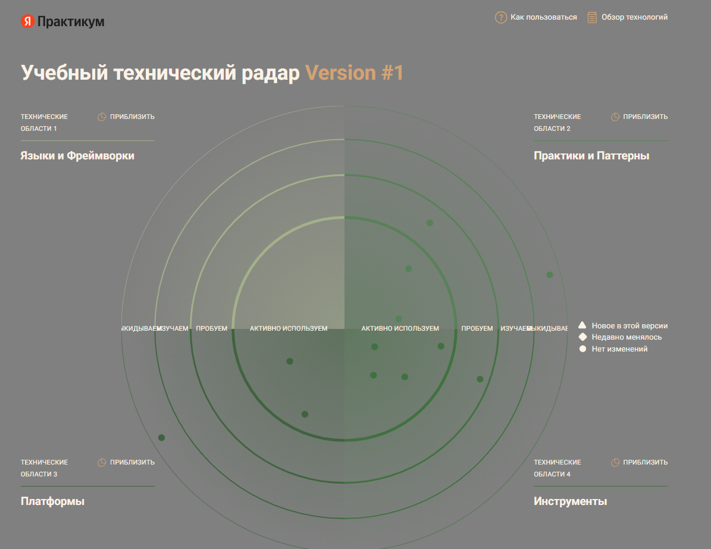
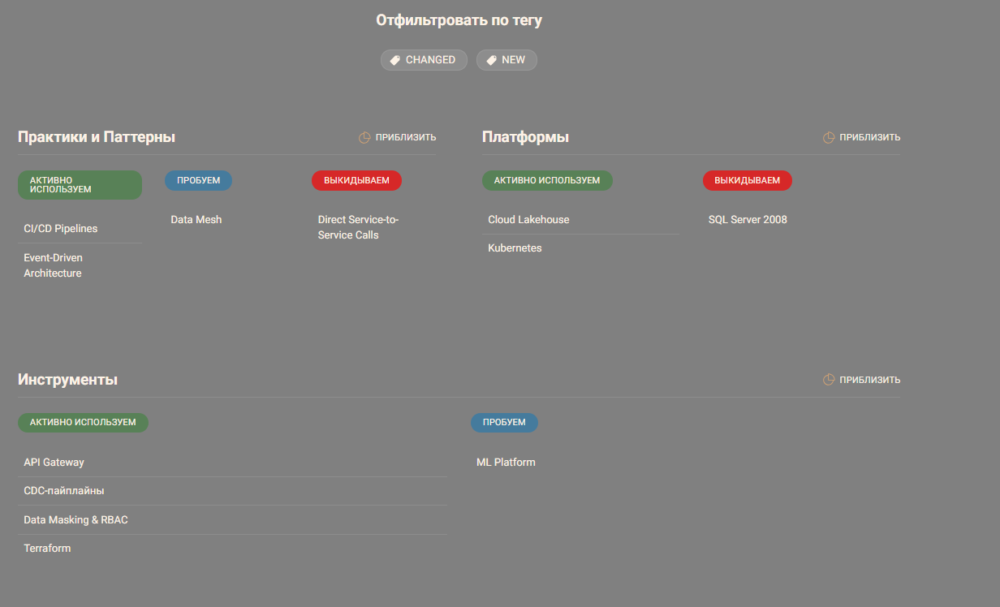
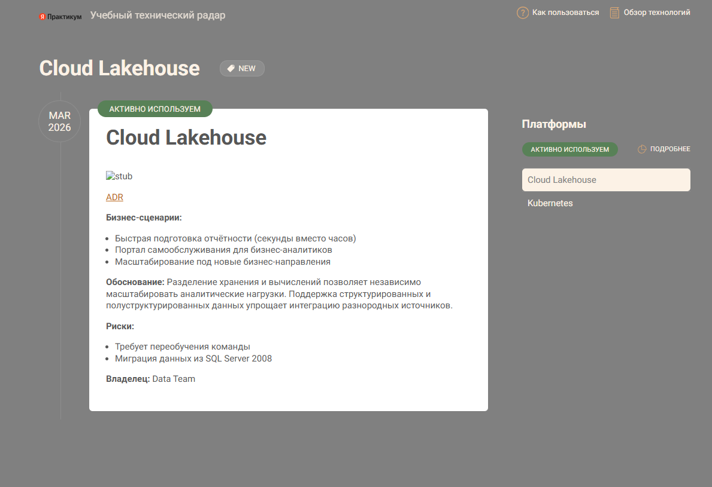

# Задание 3. Разработка технологического радара и роадмапа изменений для поддержки бизнес-целей компании

> 1. Сформируйте технический радар, на котором отразите как текущие технологии и методологии, так и предлагаемые изменения с сопутствующими инструментами. Для каждой технологии укажите, какие бизнес-сценарии он поддерживает. Например, облачные сервисы для масштабирования отчётности или Data Mesh для интеграции новых бизнесов.
>    **В ЭТОМ ДОКУМЕНТЕ**
> 2. Составьте роадмап, в котором будут отражены изменения в технологическом ландшафте компании с привязкой этапов к бизнес-целям. В нём необходимо обозначить шаги, требуемые для запуска портала самообслуживания, проекты, обеспечивающие независимое развитие подразделений, а также меры, критически важные для поддержания качества медицинских и финансовых сервисов. Для каждого этапа укажите ожидаемые результаты, ответственные команды и необходимые ресурсы.
>    📑[roadmap.md](roadmap.md)
> 3. Обоснуйте планируемые изменения, пояснив, зачем нужен каждый этап с точки зрения бизнеса. Укажите, как он влияет на скорость принятия решений, качество сервиса, снижение затрат или возможности масштабирования.
>    📑[roadmap-justification.md](roadmap-justification.md)

## Технологический радар «Будущее 2.0»

### Описание радара

Технологический радар отражает текущее состояние и целевые направления развития технологического ландшафта компании. Технологии распределены по четырём кольцам в зависимости от степени зрелости использования и по четырём квадрантам по областям применения.

