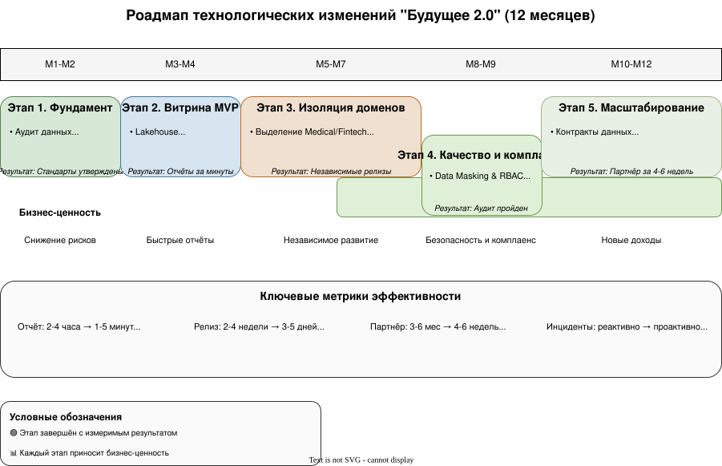

# Роадмап технологических изменений «Будущее 2.0» (12 месяцев)

Детализация роадмапа не по кварталам, а по месяцам, так как горизонт планирования 1 год, но очень насыщенный.

|   | **Этап**                     | **Срок** | **Шаги**                                                                            | **Цель**                                      | **Результат**                                               | **Кто**                          | **Ресурсы**                       |
| - | -------------------------------------- | ------------------ | --------------------------------------------------------------------------------------------- | ------------------------------------------------------- | -------------------------------------------------------------------------- | ----------------------------------------- | ---------------------------------------------- |
| 1 | Фундамент                     | М1-М2            | Аудит данных, выбор облака,  базовый CI/CD             | База для миграции                        | Стандарты утверждены, среда готова      | Архитектурный комитет | 2 архитектора, sandbox              |
| 2 | Витрина MVP                     | М3-М4            | Lakehouse, CDC для финансов,  запуск портала                | Быстрая отчётность                     | Отчёты за минуты, первые пользователи | Data Team + Frontend                      | 3 инженера, облако               |
| 3 | Изоляция доменов        | М5-М7            | Выделение Medical/Fintech, API Gateway,  события                    | Независимое развитие                 | Релизы без кросс-согласований               | Domain Teams + Platform                   | K8s, DevOps                                    |
| 4 | Качество и комплаенс | М8-М9            | Data Masking, RBAC,  аудит,  мониторинг                         | Безопасность и регуляторы   | Аудит пройден, данные защищены              | Security + SRE                            | Инструменты, консультант |
| 5 | Масштабирование         | М10-М12          | Контракты данных, первый партнёр,  пилот Data Mesh | Подключение новых бизнесов | Интеграция партнёра за 4-6 недель           | Integration + Legal                       | API-менеджер, юрист               |

## Ключевые акценты по задачам:

**Запуск портала самообслуживания:**

* Этап 2: базовый функционал (финансовые метрики)
* Этап 5: расширение на все домены, конструктор отчётов

**Независимое развитие подразделений:**

* Этап 3: чёткие границы доменов + API Gateway
* Каждый домен владеет своими данными и сервисами

**Качество медицинских и финансовых сервисов:**

* Этап 4: безопасность встроена в архитектуру (не постфактум)
* Медицинские данные изолированы, в витрину — только агрегаты

> **Принцип:**
> Каждый этап добавляет измеримую бизнес-ценность.
> Миграция итеративная, легаси-системы поддерживаются параллельно до полного перехода.
