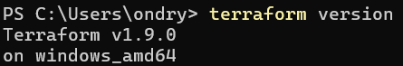

# Подготовка

```powershell
choco install terraform
```

Или скачать с оф.сайта [hashicorp.com](https://developer.hashicorp.com/terraform/install)

Если недоступен, то используй [зеркало](https://mirror.selectel.ru/3rd-party/hashicorp-releases/terraform/1.9.0/terraform_1.9.0_windows_amd64.zip)

После установки нужно добавить в PATH 

`[Environment]::SetEnvironmentVariable("Path", $env:Path + ";C:\Users\ondry\Downloads\terraform_1.9.0_windows_amd64", "User")`

Проверка

```powershell
terraform version
```



PS Лучше было конечно сюда `C:\Tools\terraform`

Жизненный цикл работы с Terraform состоит из четырех основных команд:

1. `terraform init`
   * Инициализирует рабочую директорию.
   * Скачивает необходимые провайдеры.
   * *Запускается один раз в начале работы над проектом.*
2. `terraform plan`
   * Анализирует код и сравнивает его с реальным состоянием инфраструктуры.
   * Показывает план действий (что будет создано, изменено или удалено).
   * *Ничего не меняет в облаке, только показывает.*
3. `terraform apply`
   * Применяет план, созданный на предыдущем шаге.
   * Создает или изменяет ресурсы в облаке.
   * *Требует подтверждения (введите `yes`).*
4. `terraform destroy`
   * Удаляет все ресурсы, управляемые этим конфигурацией.
   * *Используйте для очистки тестовых сред, чтобы не платить лишнее.*
