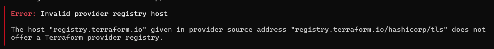

# Как запустить

## 1. Установите переменные окружения (подставьте свои значения!)

Bash

```bash
export TF_VAR_yc_token="t1.9eu1..."
export TF_VAR_yc_cloud_id="b1g..."
export TF_VAR_yc_folder_id="b1h..."
```

Windows

```powershell
$env:TF_VAR_yc_token="t1.9eu1..."
$env:TF_VAR_yc_cloud_id="b1g..."
$env:TF_VAR_yc_folder_id="b1h..."
```

Получите IAM-токен (действует 12 часов)

> `yc iam create-token`

> Чтобы их узнать выполни `yc config list`, при этом cli клиент должен уже стоять, если не знаешь как поставить - следуй инструкции [тут](https://yandex.cloud/ru/docs/cli/quickstart)

## 2. Подготовьте tfvars

cp terraform.tfvars.example terraform.tfvars

## 3. Инициализация (скачает провайдеры)

terraform init

Может быть проблема



Скачайте провайдер вручную:

- https://github.com/yandex-cloud/terraform-provider-yandex/releases

Распакуйте в локальную папку плагинов:

```powershell
%APPDATA%\terraform.d\plugins\yandex-cloud\yandex\terraform-provider-yandex_0.192.0_windows_amd64\
```

## 4. Посмотрите, что будет создано

terraform plan -out=tfplan

## 5. Примените (создаст ресурсы в облаке)

terraform apply tfplan

## 6. Подключитесь к ВМ (ключ сохранится в generated_ssh_key.pem)

chmod 600 generated_ssh_key.pem
ssh -i generated_ssh_key.pem ubuntu@<IP-из-output>

## Удалить все созданные ресурсы

terraform destroy

## Очистить локальные артефакты

rm -rf .terraform* terraform.tfstate* tfplan generated_ssh_key.pem
